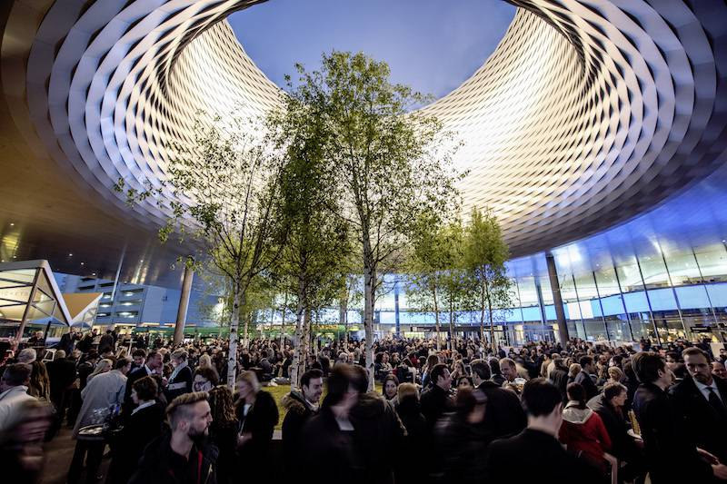

### Board of Organizers

__Sigrid Behr__, Novartis Pharma AG, Basel  
__Andrea Burden__,ETH Zurich, Zurich  
__Bernadette Dwan__, IQVIA, Basel   
__Susan Edwards__, Hoffmann-La Roche, Basel   
__Christoph R. Meier__, Basel Pharmacoepidemiology Unit and Hospital Pharmacy, University of Basel  
__Alexander Michel__, Bayer Consumer Care AG, Basel  
__Julie Mouchet__, Novartis Pharma AG, Basel  
__Audrey Muller__, Janssen Pharmaceutical companies of Johnson & Johnson, Basel   
__Nicole Probst__, Swiss Tropical and Public Health Institute, University of Basel  
__Daniel Rosenberg__, Janssen Pharmaceutical companies of Johnson & Johnson, Basel  
__Thibaut Sanglier__, Hoffmann-La Roche, Basel  
 

[__Contact__](mailto:sigrid.behr@novartis.com)

### E-mail announcements of events

If you would like to receive e-mail announcements of upcoming events please send an email to [__Sigrid Behr__](mailto:sigrid.behr@novartis.com).

  
  

